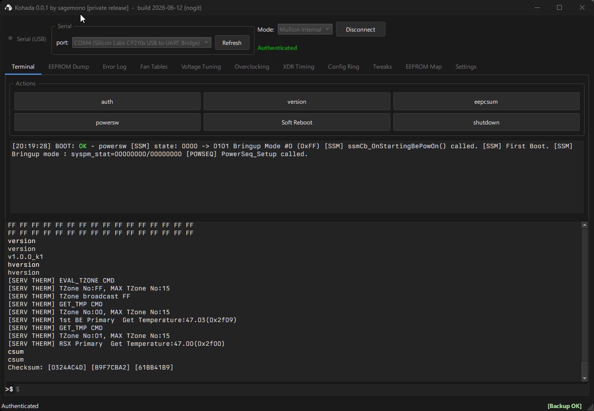

# Kohada

**A repair & tuning toolkit for the PlayStation 3 system controller (syscon)**

Talks to Mullion and Sherwood syscon controllers over UART

---

> [!WARNING]
> **Kohada is early-stage software that reads and *writes* the syscon EEPROM.**
> Incorrect writes can **permanently brick your console.** The author is **not
> responsible** for any damage, data loss, or other issues resulting from use of
> this tool. Use entirely at your own risk, and **always dump your EEPROM and
> keep multiple backups in a safe location before changing anything.**

---

## Demo

## Features

- **EEPROM dump** - self sizing dump of the full syscon NVS (20 KB / 32 KB auto detected) plus the secondary 0x48xxx pages, saved to a single self describing container file.
- **Console identity restore guard** - before a restore, Kohada reads the QA token + platform ID + manufacturing strings from the live console and compares them to the backup, so you can't accidentally flash one console's EEPROM onto another.
- **EEPROM hex editor** with named region map and automatic checksum fix-up.
- **Fan curve editor** - drag to edit fan curves per thermal zone, with factory presets.
- **Voltage tuner** - Cell/RSX VID editor with a safety-gated range.
- **CELL / XDR overclocking** - clock generator configuration.
- **XDR memory timing override** - full 46-entry MIC descriptor editor.
- **Config ring editor** - Cell BE config-ring patch sources + scatter table.
- **NVS tweak panel** - typed editors for the documented syscon NVS fields.
- **Error-log decoder** - reads and decodes the syscon error log against a community maintained code database.

## Platform support

| Family | Status |
|--------|--------|
| **Mullion** (CXR713 / CXR714 early fat consoles) | Primary target. Well supported. |
| **Sherwood** (late fat / slim / super slim) | **Very limited.** Some features may not work or may be **broken entirely.** Treat Sherwood support as experimental. |

## Download & run

Builds are distributed as a zip outside this repository (this repo does not host
binaries). To run a build:

1. **Extract the entire folder first** — do not run `kohada.exe` from inside the zip. It needs the Qt DLLs and the `platforms` folder beside it.
2. Run `kohada.exe` and read the disclaimer.
3. Go to the **EEPROM Dump** tab, dump your EEPROM, and **save the backup to a safe location. Keep more than one copy.**

## Safety: dump first, always

The golden rule. Before touching any value:

1. Dump your EEPROM (**EEPROM Dump** tab).
2. Save the `.scdump` somewhere safe, on more than one device.
3. Only then make changes.

That dump is your only way back if a write goes wrong.

> Note: **Full Restore rewrites main NVS only.** The secondary 0x48xxx pages
> (including the QA token) are archived in your backup for reference but are
> **not** written back during a restore.

## Contributing error definitions

Kohada is **not open source**, but the error-code database ([`src/core/error_codes.h`](src/core/error_codes.h)) **is** published here so the community can improve it. If you've decoded a syscon error the tool doesn't recognise, or have better repair context for an existing one, contributions to that file are welcome via pull request.

This is the only source file in the repository, the rest of the application is closed source.

## Disclaimer

This software is provided "as is", without warranty of any kind. You assume all risk for any damage to your hardware or data. Not affiliated with or endorsed by Sony Interactive Entertainment.